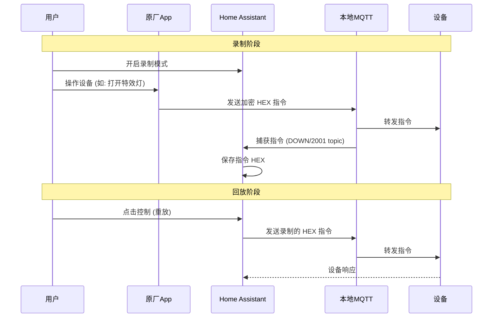

# 花语前湾转接器 (HYQW Adapter)

[](https://github.com/hacs/integration)
[](https://github.com/origintree)

Home Assistant 集成，用于接入和控制**花语前湾**小区的智能家居设备。

本插件支持通过解析手机 App 的抓包数据（HAR 文件）自动配置设备，并采用 **本地化 MQTT 劫持** 架构。针对部分加密的 MQTT 控制指令，内置了**重放攻击 (Replay Attack)** 工具，通过录制并重放加密的 HEX 指令来实现对特殊设备的控制。

## ✨ 主要功能

*   **⚡ 极速响应**：基于本地 MQTT 劫持架构，摆脱云端延迟，实现毫秒级控制。
*   **☁️ 双向同步**：通过 MQTT 双向桥接技术，在实现本地控制的同时，保留原 App 的远程控制能力。
*   **🛡️ 重放控制**：针对使用私有加密协议的设备，支持录制 App 发送的原始 HEX 指令，通过“重放攻击”的方式实现控制，无需破解加密算法。
*   **🔌 自动配置**：导入 HAR 文件，一键识别全屋设备（灯具、空调、地暖、窗帘、新风）。
*   **📍 区域映射**：自动解析户型结构，支持将房间映射到 Home Assistant 的 Area。
*   **🌡️ 智能温控**：支持将外部温度传感器绑定到空调/地暖，解决原设备温度检测不准的问题。

## 🏗️ 架构说明

本插件推荐采用 **MQTT 本地化劫持** 方案，架构如下：

```mermaid
graph TD
    Cloud[云端 MQTT 服务器]
    LocalBroker[本地 Mosquitto Broker]
    App[手机 App]
    HA[Home Assistant]
    Gateway[485 网关 (物理设备)]
    Router[路由器 (DNS劫持)]

    subgraph "局域网 (Local Network)"
        Router -- DNS劫持 --> LocalBroker
        Gateway -- MQTT连接 --> LocalBroker
        HA -- 插件直连 --> LocalBroker
        App -- MQTT连接 --> LocalBroker
    end

    LocalBroker -- "双向桥接 (Bridge)" --> Cloud
    
    style LocalBroker fill:#f9f,stroke:#333,stroke-width:2px
    style Router fill:#bbf,stroke:#333,stroke-width:1px
    style Gateway fill:#bfb,stroke:#333,stroke-width:1px
```

1.  **DNS 劫持**: 在路由器层面对云端 MQTT 域名进行 DNS 劫持，将流量重定向到本地局域网的 MQTT Broker。
2.  **本地 MQTT 桥接**: 本地 MQTT Broker 配置为双向桥接 (Bridge) 模式，作为中转站连接真实的云端服务器。
3.  **插件接入**: Home Assistant 插件连接本地 MQTT Broker，直接发送控制指令并接收状态上报。

## 📦 安装方法

### 方式一：通过 HACS 安装（推荐）

1.  打开 HACS -> Integrations (集成)。
2.  点击右上角的三个点 -> Custom repositories (自定义存储库)。
3.  输入仓库地址：`https://github.com/origintree/hyqw_adapter`。
4.  类别选择 `Integration`。
5.  点击 `Add`，然后在列表中找到 "花语前湾转接器" 进行下载安装。
6.  重启 Home Assistant。

### 方式二：手动安装

1.  下载本仓库的 `hyqw_adapter` 文件夹。
2.  将其复制到你的 Home Assistant 配置目录下的 `custom_components` 文件夹内。
3.  重启 Home Assistant。

## ⚙️ 基础配置指南

### 1. 获取抓包数据 (HAR 文件)

1.  在手机上安装抓包工具（iOS 推荐 Stream/Surge/Proxyman，Android 推荐 HttpCanary）。
2.  开启抓包（MITM 模式）。
3.  打开“花语前湾” App，刷新首页设备列表。
4.  导出为 **HAR** 格式文件，并复制文件内容。

### 2. 添加集成

1.  在 Home Assistant 中，进入 **配置** -> **设备与服务** -> **添加集成**。
2.  搜索 `花语前湾转接器`，粘贴 HAR 文件内容。
3.  根据提示配置房间映射。

## 🌐 MQTT 本地化配置 (进阶)

要实现最佳体验，请按以下步骤配置本地 MQTT 环境：

### 1. 搭建本地 MQTT Broker
推荐使用 Mosquitto。在 Home Assistant OS 上可直接安装 Mosquitto Broker 插件。

### 2. 配置 DNS 劫持
在你的主路由器（如 iKuai, OpenWrt, ROS）上，配置 DNS 静态解析：
*   **域名**: (请在抓包数据中查找设备的 MQTT 连接域名)
*   **IP 地址**: 指向你的本地 MQTT Broker IP 地址

### 3. 配置 MQTT 桥接 (Bridge)
为了保持原 App 可用，需要在本地 Mosquitto 配置桥接，透传数据到云端。
在 `mosquitto.conf` 或 `/share/mosquitto/bridge.conf` 中添加：

```conf
connection cloud_bridge
address <云端MQTT服务器IP或域名>:<端口>
remote_username <云端账号>
remote_password <云端密码>
clientid <自定义桥接ID>
try_private true
notifications true
cleansession true
topic # both 0
```
*(注：云端连接信息（特别是密码）通常无法直接在手机 App 抓包中看到，你需要**抓包 485 网关**与云端的通讯流量才能获取到真实的 MQTT 账号密码)*

### 4. 插件启用 MQTT
1.  集成添加成功后，会生成一个 MQTT 网关实体。
2.  在实体选项中，填入**本地 MQTT Broker** 的连接信息。
3.  启用 MQTT 功能。

## 📼 录制与回放 (高级功能)

对于某些使用加密协议无法直接生成控制指令的设备，本插件提供了“录制/回放”功能：



1.  **开启录制**：在 Home Assistant 中调用服务的录制模式。
2.  **操作设备**：在原厂 App 中操作一次设备（例如打开某个特殊的灯光模式）。
3.  **捕获指令**：插件会自动捕获经过 MQTT 的加密 HEX 指令并保存。
4.  **重放控制**：之后在 Home Assistant 中操作该设备时，插件会直接重发这段录制的 HEX 指令，从而实现控制。

## 🤝 贡献与反馈

欢迎提交 [Issue](https://github.com/origintree/hyqw_adapter/issues) 或 Pull Request。

## ⚠️ 免责声明

本插件为第三方开源项目，仅供学习交流和个人使用。使用本插件产生的任何风险由用户自行承担。
